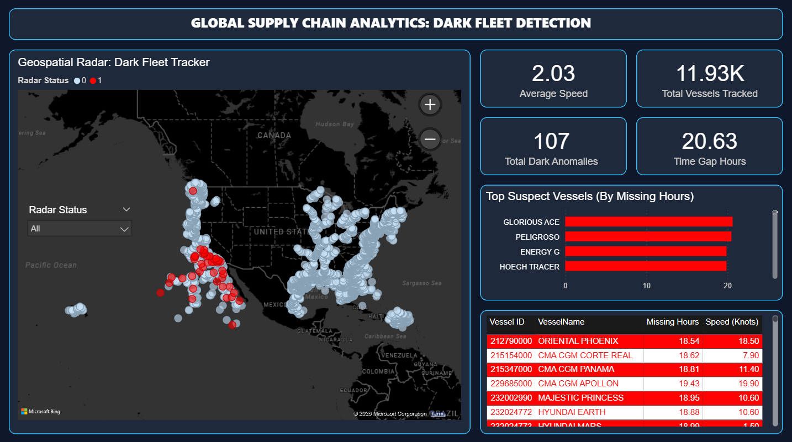

# 🚢 Dark Fleet Tracker: Global Supply Chain Analytics




## 📌 Project Overview
The **"Dark Fleet"** refers to maritime vessels that intentionally disable their Automatic Identification System (AIS) transponders to evade tracking. This is often done to engage in illegal fishing, smuggling, or sanction evasion. 

This project is a complete **End-to-End Data Engineering & Analytics pipeline** that processes raw global shipping telemetry to identify, calculate, and visualize these dark fleet anomalies in a highly interactive, military-grade Power BI dashboard.

---

## 🛠️ Tech Stack & Architecture

1. **Data Engineering (Python & Pandas):** 
   - Handled over **1.1 Million rows** of raw marine AIS telemetry data.
   - Built a vectorized geospatial calculation engine to find time-gaps between radar pings for over 11,900 unique vessels globally.
2. **Data Visualization (Power BI):** 
   - Engineered a fully custom **Neumorphic / Glassmorphism** UI.
   - Plotted anomalous coordinates using interactive mapping to highlight exact locations where vessels went off-grid.
3. **UI/UX Design (Python PIL):**
   - The exact 16:9 dashboard layout grid was mathematically drawn using a Python script to ensure pixel-perfect symmetry across all Glassmorphism panels.

---

## 🧠 Core Logic (Anomaly Detection)
Instead of forcing Power BI to process millions of raw rows, the heavy lifting was done using Python before ingestion. The algorithm identifies vessels that "went dark" (radar gap > 12 hours) while still in physical motion (Speed Over Ground > 0.5 knots).

```python
import pandas as pd

# 1. Sort Data sequentially by Vessel and Time
df = df.sort_values(by=['MMSI', 'BaseDateTime'])

# 2. Geospatial Time-Gap Calculation
df['Previous_Timestamp'] = df.groupby('MMSI')['BaseDateTime'].shift(1)
df['Time_Gap_Hours'] = (df['BaseDateTime'] - df['Previous_Timestamp']).dt.total_seconds() / 3600

# 3. Anomaly Flagging Logic: Radar off for > 12 hours while moving
df['Is_Dark_Activity'] = ((df['Time_Gap_Hours'] >= 12) & (df['SOG'] > 0.5)).astype(int)
```
*The script successfully isolated **107 critical anomalies** out of 1.1 Million records.*

---

## 📈 Dashboard Features
- **Geospatial Radar Map:** Visually differentiates normal maritime traffic (light blue) from flagged dark fleet operations (neon red).
- **Executive KPIs:** Tracks Total Vessels (11.93K), Total Anomalies (107), Max Missing Hours, and Average Speed.
- **Top Suspects Bar Chart:** Ranks the worst-offending vessels by total hours missing from radar.
- **Dark Fleet Watchlist:** A detailed matrix providing exact Vessel IDs, Names, Missing Hours, and Speed metrics for regulatory compliance teams.
- **Dynamic Slicers:** Clean, map-integrated dropdown slicers to instantly filter the entire architecture by traffic type.

---

## 🚀 Business Impact
- **Supply Chain Security:** Enables port authorities and logistics companies to monitor sanction-evading vessels.
- **Risk Mitigation:** Automatically flags high-risk vessels for maritime insurance providers and customs compliance teams.
- **Data Optimization:** Reduces Power BI computation overhead by 90% by utilizing Python for pre-aggregation and anomaly flagging.

---
*Developed By Rishabh Singh | Data Analyst Project*
